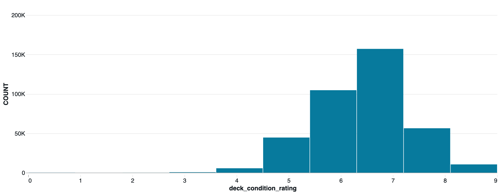
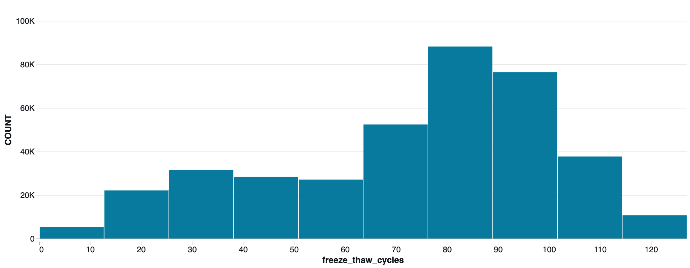
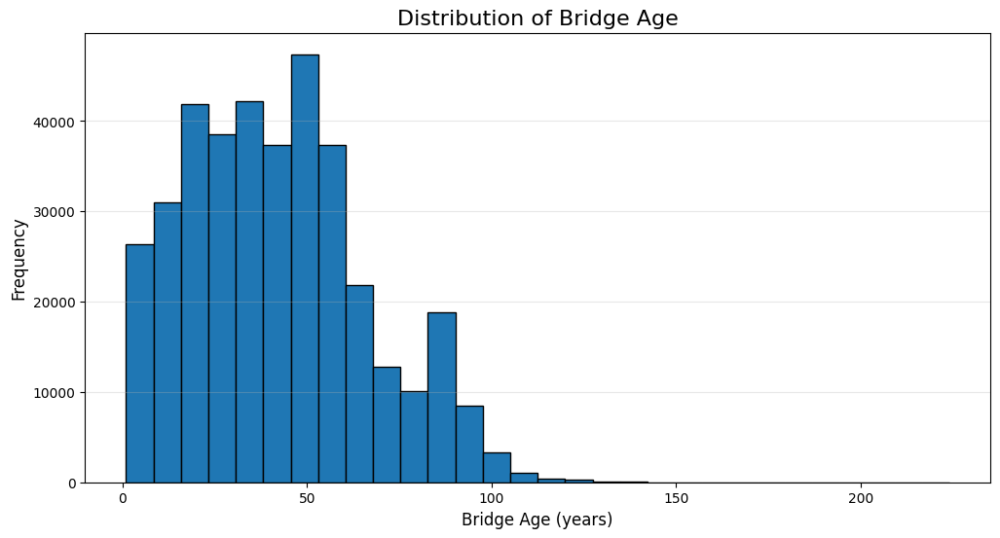
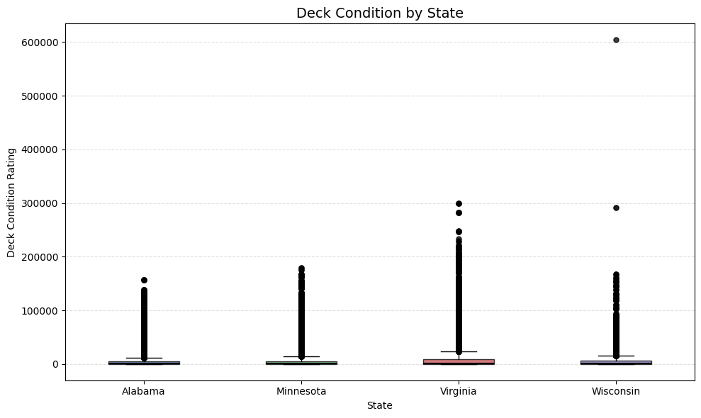
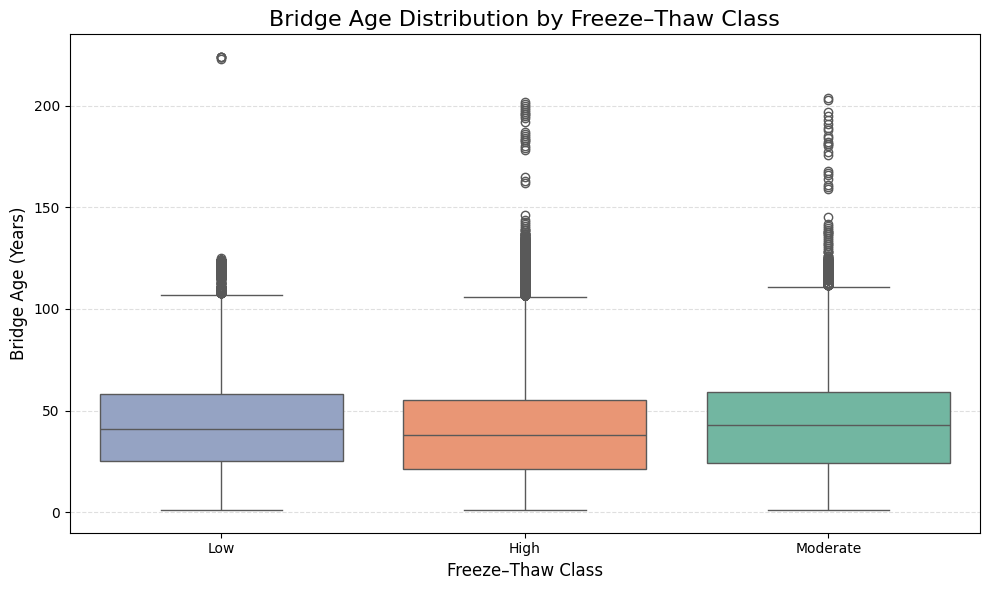

# 🌉 Bridge Infrastructure Analytics: Predictive Maintenance and Structural Health Assessment


## 📖 Project Overview

Bridge infrastructure is a critical component of transportation networks, and timely maintenance is essential for ensuring structural safety and minimizing repair costs. This project analyzes the **National Bridge Inventory (NBI)** dataset using **Apache Spark (PySpark)** to perform large-scale data processing, exploratory data analysis (EDA), and infrastructure health assessment.

The project demonstrates how big data analytics can support bridge inspection, condition assessment, deterioration analysis, and maintenance planning through scalable data processing techniques.

---

## ✨ Project Highlights

- Large-scale bridge infrastructure analytics using Apache Spark
- End-to-end data cleaning and preprocessing
- Exploratory Data Analysis (EDA)
- Infrastructure condition assessment
- Trend and deterioration analysis
- Power BI dashboard integration

---


## 🎯 Project Objectives

The primary objectives of this project are:

- Analyze bridge inspection and condition data from the National Bridge Inventory.
- Perform data cleaning and preprocessing using Apache Spark.
- Explore structural characteristics and bridge condition distributions.
- Identify deterioration patterns across bridge components.
- Analyze trends that support predictive maintenance strategies.
- Demonstrate scalable analytics for large infrastructure datasets.

---

## 📊 Dataset

**Dataset:** National Bridge Inventory (NBI)

The dataset contains detailed bridge inspection records, including:

- Bridge identification
- Geographic information
- Structural characteristics
- Construction details
- Inspection history
- Deck, Superstructure, and Substructure condition ratings
- Traffic information
- Maintenance-related attributes

> **Note:** The original dataset (`PS1.csv`) is **not included** in this repository because of its large size.

For Databricks execution, place the dataset in:

```text
/Volumes/workspace/default/raw-data/PS1.csv
```

---

## 🛠️ Technologies Used

| Technology | Purpose |
|------------|---------|
| Python | Data analysis |
| Apache Spark (PySpark) | Large-scale data processing |
| Databricks | Development environment |
| SQL | Data querying |
| Power BI | Interactive dashboards |
| Git & GitHub | Version control |
| Jupyter Notebook | Documentation and analysis |


---

## 🔬 Project Methodology

The project follows a structured analytics workflow to transform raw bridge inspection data into meaningful insights.

1. **Data Loading**
   - Import the National Bridge Inventory dataset into Apache Spark.
   - Configure schema inference and CSV parsing options.

2. **Data Cleaning**
   - Handle missing values.
   - Remove duplicate records.
   - Validate data quality and consistency.

3. **Exploratory Data Analysis (EDA)**
   - Analyze bridge characteristics.
   - Examine condition ratings.
   - Study structural attributes.
   - Explore traffic and geographic distributions.

4. **Group-wise Analysis**
   - Compare bridge conditions across different categories.
   - Analyze bridge age, material, and structural type.

5. **Trend Analysis**
   - Identify deterioration patterns.
   - Evaluate inspection trends.
   - Support maintenance planning.

6. **Visualization**
   - Create informative charts for bridge conditions.
   - Visualize structural characteristics.
   - Present analytical findings.

---

## 📁 Repository Structure

```text
bridge_infrastructure_analytics/
│
├── data/
│   ├── raw/
│   │   ├── README.md
│   │   └── PS1.csv (local only – not tracked)
│   └── processed/
│
├── docs/                  # Project documentation
├── figures/               # Images and visualizations
├── notebooks/             # Jupyter notebooks developed in Databricks
├── powerbi/               # Power BI dashboards
├── sql/                   # SQL queries
├── src/                   # Future Python modules
│
├── README.md
├── requirements.txt
└── .gitignore
```

---

## 📈 Key Analyses

The notebook includes the following analyses:

- Data quality assessment
- Missing value analysis
- Duplicate record analysis
- Bridge condition assessment
- Structural component analysis
- Bridge age analysis
- Material-wise analysis
- State-wise bridge statistics
- Traffic analysis
- Deterioration trend analysis
- Statistical summaries
- Data visualization using Apache Spark


---

## 📊 Results and Insights

This project provides valuable insights into bridge infrastructure through large-scale data analysis. The key outcomes include:

- Comprehensive assessment of bridge condition ratings.
- Analysis of structural characteristics and bridge inventory.
- Identification of deterioration trends across bridge components.
- State-wise and category-wise comparisons of bridge conditions.
- Data-driven insights to support infrastructure maintenance planning.

The project demonstrates how Apache Spark can efficiently process and analyze large transportation infrastructure datasets.


## 📷 Visualizations

### 1. Distribution of Deck Condition

The deck condition ratings are concentrated between **6 and 7**, indicating that most bridges are currently in fair to good condition, while relatively few bridges are in very poor condition.



---

### 2. Distribution of Freeze–Thaw Cycles

The majority of bridges experience **70–100 freeze–thaw cycles annually**, highlighting the significant environmental exposure that contributes to long-term structural deterioration.



---

### 3. Distribution of Bridge Age

Most bridges are **30–60 years old**, with fewer very old structures. The long right tail indicates the presence of aging infrastructure requiring continued monitoring.



---

### 4. Deck Condition by State

Average deck condition varies across states. Differences in climate, maintenance practices, and environmental exposure contribute to variations in bridge health.



---

### 5. Bridge Age by Freeze–Thaw Class

Bridges located in regions with moderate and high freeze–thaw exposure generally exhibit higher age distributions and greater variability, suggesting cumulative environmental effects over time.



---

## 📈 Machine Learning Results

An XGBoost regression model was developed to predict bridge deck condition ratings using structural, environmental, and traffic-related features.

### Model Performance

| Metric | Value |
|---------|------:|
| RMSE | **0.668** |
| R² Score | **0.579** |

### Most Important Features

| Rank | Feature |
|------|---------|
| 1 | Bridge Age |
| 2 | Age² |
| 3 | State |
| 4 | Main Span Material |
| 5 | Log(ADT) |
| 6 | Deck Area |
| 7 | Average Daily Traffic |
| 8 | Freeze–Thaw per Age |
| 9 | Freeze–Thaw² |
| 10 | Freeze–Thaw Zone |

The results indicate that **bridge age** is the strongest predictor of deck condition, followed by material type, geographic location, traffic exposure, and environmental factors. These findings demonstrate the effectiveness of combining structural and climate-related variables for predictive bridge health assessment.
---

## ▶️ How to Run

### Prerequisites

- Databricks Workspace
- Apache Spark (PySpark)
- National Bridge Inventory dataset (`PS1.csv`)

### Dataset Location

Upload the dataset to the following Databricks Volume:

```text
/Volumes/workspace/default/raw-data/PS1.csv
```

### Running the Notebook

1. Open the notebook in Databricks.
2. Attach it to a Spark cluster.
3. Ensure the dataset is available in the configured location.
4. Run the notebook cells sequentially.

> **Note:** This notebook was developed and tested in the Databricks environment. The `spark` session is automatically initialized by Databricks.

---

## 🚀 Future Improvements

Potential extensions of this project include:

- Predictive models for bridge deterioration.
- Machine learning–based maintenance prioritization.
- Interactive dashboards for infrastructure monitoring.
- GIS-based spatial visualization of bridge assets.
- Integration with real-time bridge inspection data.

---

## 💡 Skills Demonstrated

- Data Cleaning
- Data Wrangling
- Exploratory Data Analysis
- Big Data Analytics
- Apache Spark
- Data Visualization
- Infrastructure Analytics
- Statistical Analysis
- Dashboard Development
---


---

## 👩‍💻 Author

**Dr. Pooja Shah**

M.S. in Data Analytics Engineering, George Mason University  
Ph.D. in Applied Mathematics

📫 **GitHub:** https://github.com/DrPoojaShah

📫 **LinkedIn:** https://www.linkedin.com/in/drpoojashah

---

⭐ If you found this project interesting, consider giving the repository a star!
---


## 🙏 Acknowledgments

This project was developed for educational and portfolio purposes using the National Bridge Inventory dataset and Apache Spark on Databricks.
---


## 📄 License

This repository is intended for educational, research, and portfolio purposes.

